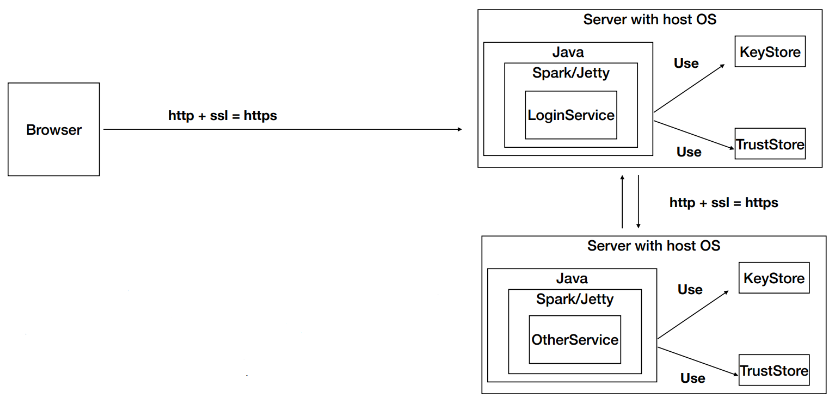
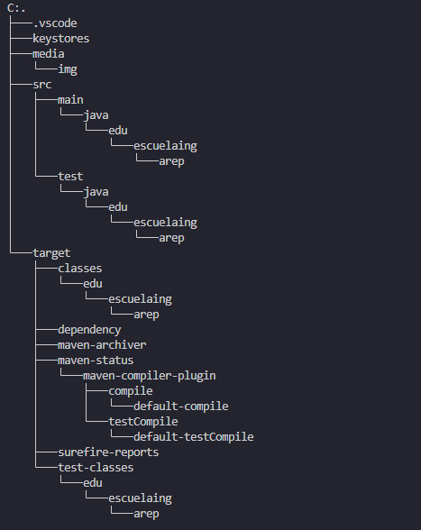
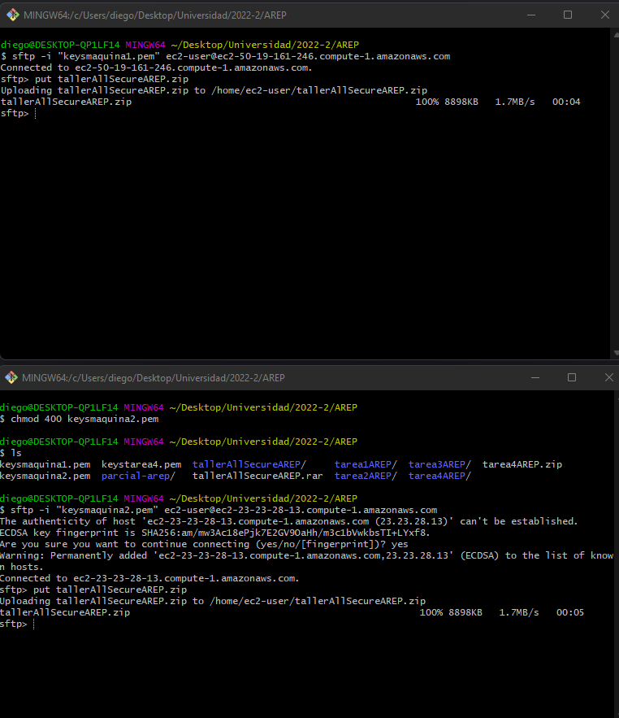
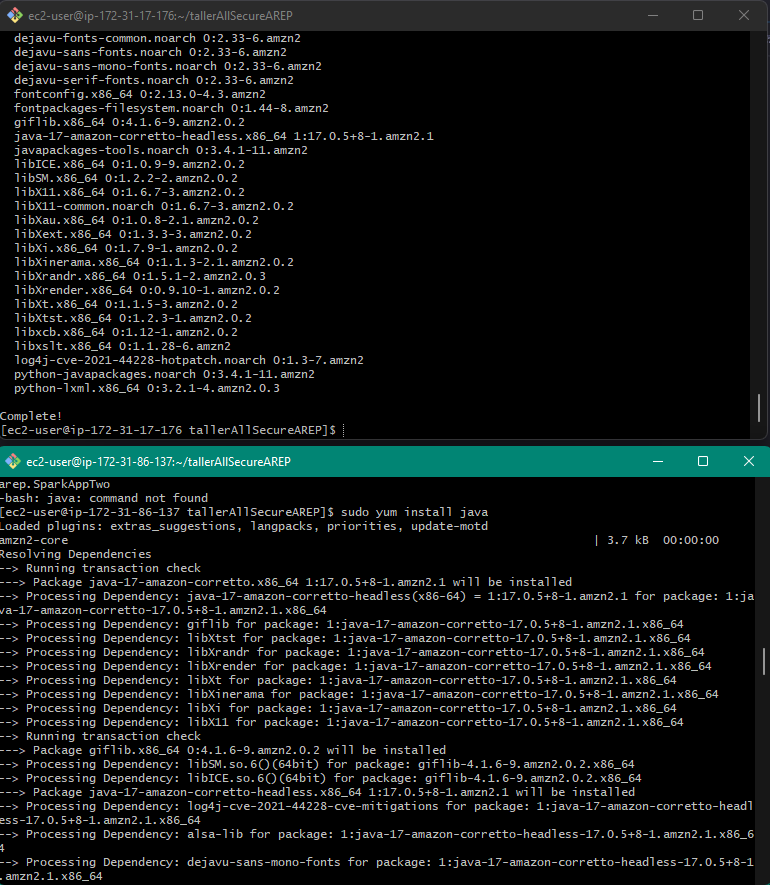
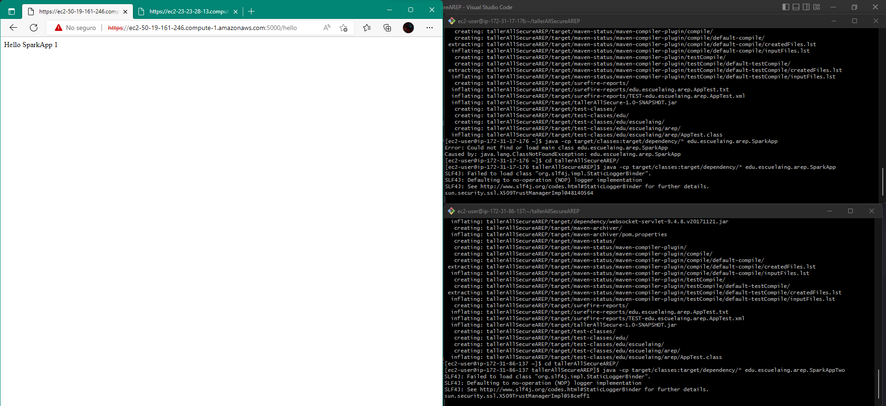
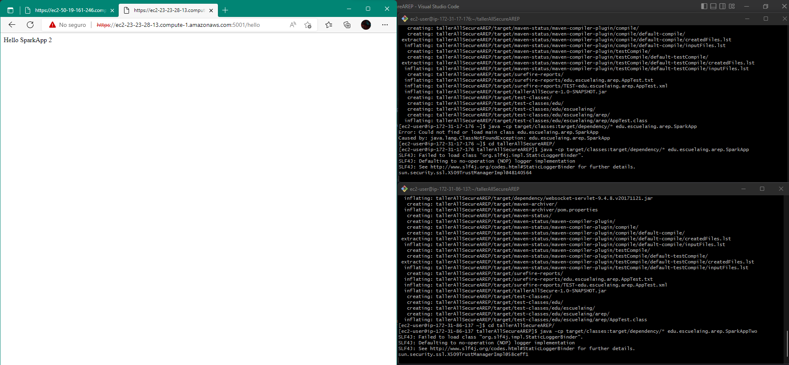
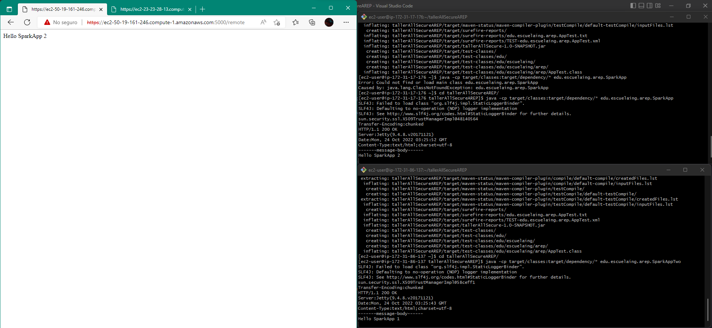

# Taller AllSecureAppSpark
## AREP
## Diego Leon
## 2022-2

## Descripción

Este taller tiene como objetivo el desarrollo de una aplicación web con acceso seguro desde el browser de la aplicacion, por lo que, se garantiza autenticación, autorización e integridad de usuarios. Asimismo, vamos a tener dos maquinas virtuales EC2 en AWS que se van a comunicar entre si, garantizando lo mencionado anteriormente entre los servicios.
Para esto se utilizó el framework Spark, el cual permite el desarrollo de aplicaciones web en Java.

## Arquitectura



## Pre-requisitos

- [Java](https://www.java.com/es/download/)
- [Maven](https://maven.apache.org/download.cgi)

## Tree



## Procedimiento

Se hace mvn package para allSecureAppSpark y lo convertimos a un zip para poderlo subir a las maquinas virtuales EC2. Y lo subimos por medio del comando put entrando a la maquina virtual por medio de sftp.



Descomprimimos el zip en la maquina virtual entrando por medio de ssh y usando el comando unzip. Debido a que, queremos ejecutar la aplicacion tenemos que instalar java en la maquina virtual.



Corremos la aplicacion en la maquina virtual 1 con el comando:

```
java -cp target/classes:target/dependency/* edu.escuelaing.arep.SparkApp
```

En la maquina virtual 2 corremos la aplicacion con el comando:

```
java -cp target/classes:target/dependency/* edu.escuelaing.arep.SparkAppTwo
```

## Pruebas








## Video


## Licencia

